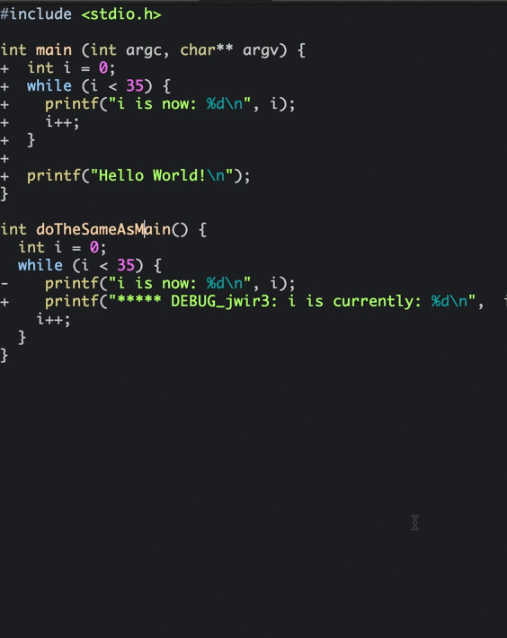
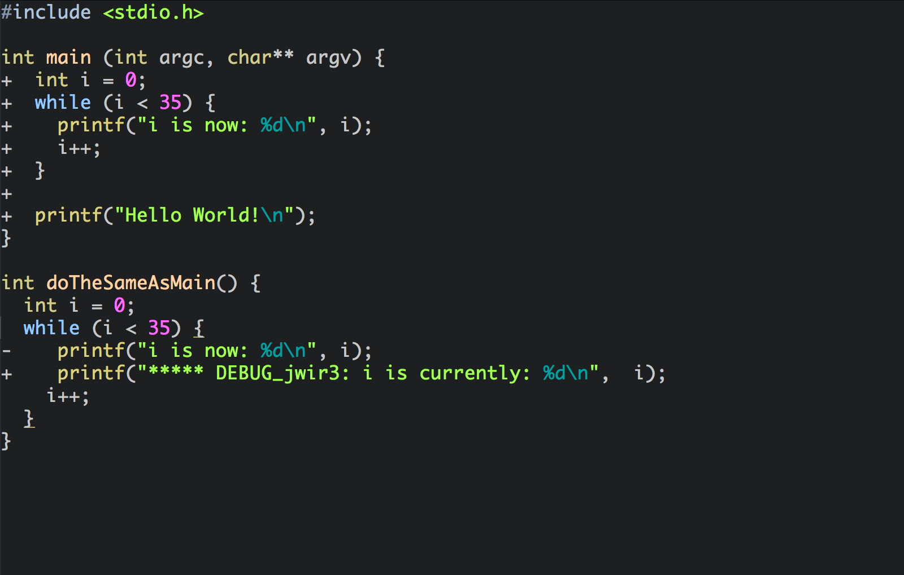
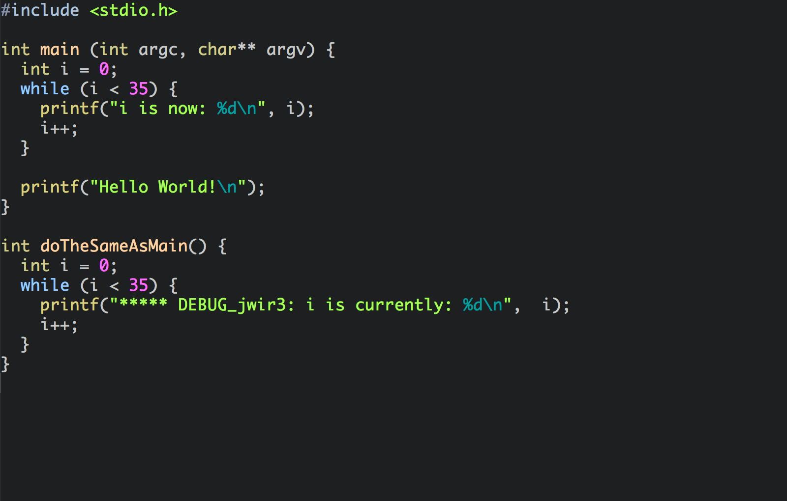

Patchwork
============

An atom package designed to work with git and hg patch blocks within source files.

Introduction
------------

Merging is hard. It's made even more difficult if you aren't able to cut and paste
the pieces of your code you want into source files during the merge because of extraneous
diff annotations.

Patchwork makes this easier by cleaning up intermittent pieces of "patch" code in
your source files. It removes the diff annotations interspersed in your source
code by removing preceding '+' signs from source lines, and removing lines starting
with '-' signs:

**Before**:

**After:**

Using Patchwork
-------------

You can either use the keyboard shortcut (by default <kbd>CTRL</kbd> + <kbd>ALT</kbd> + <kbd>P</kbd>), or activate Patchwork from the Packages menu, under Packages -> Patchwork -> Toggle.

FAQ
-------------

* __Why not just use a merge tool?__
  * You should. The thing is, sometimes you need to take portions of a patch from a rejected merge (".rej") or diff file and put those portions into your source code. Trying to retype code from a rejected merge file directly into your source files is time-consuming and error-prone. On the other hand, cutting and pasting code from the rejected merge file (or files) into your editor gives you extraneous '+' and '-' lines in your source file(s). This is where patchwork comes in. You can cut and paste from these rejected blocks directly into your source file, and rely on patchwork to clean up the annotation lines.
